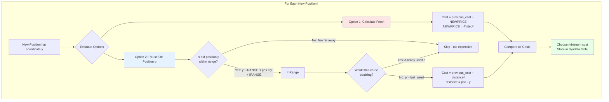
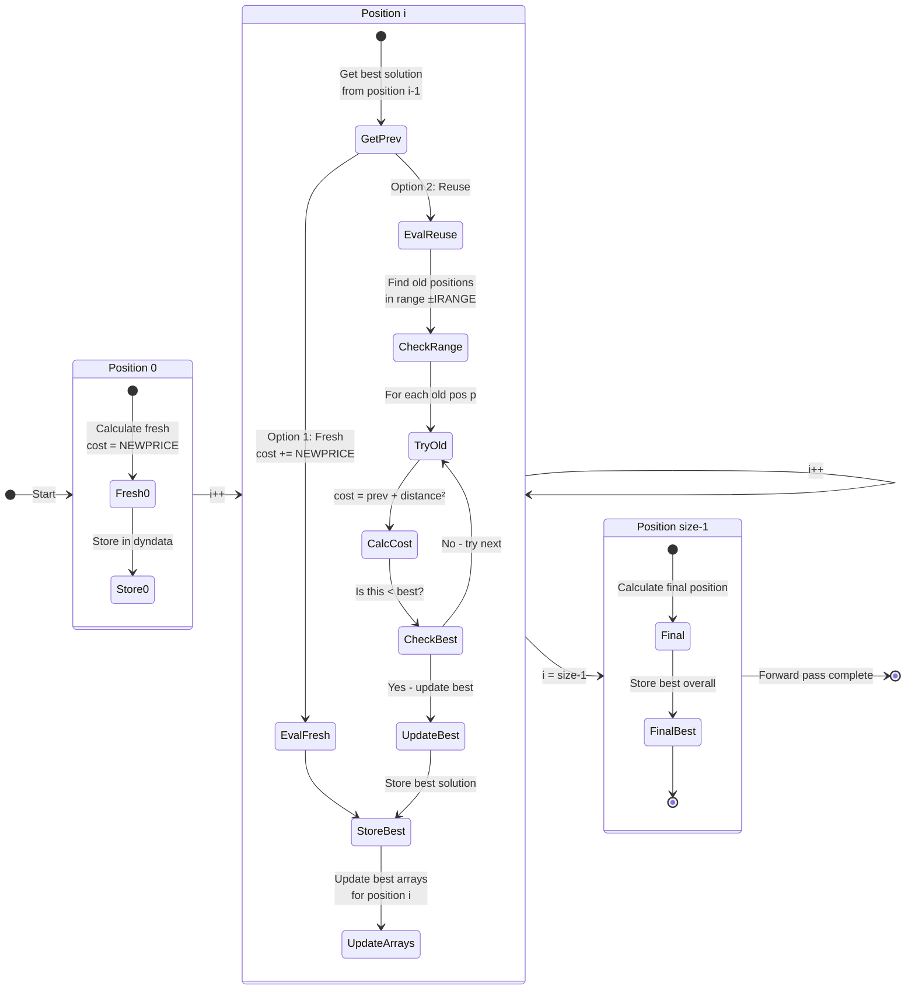
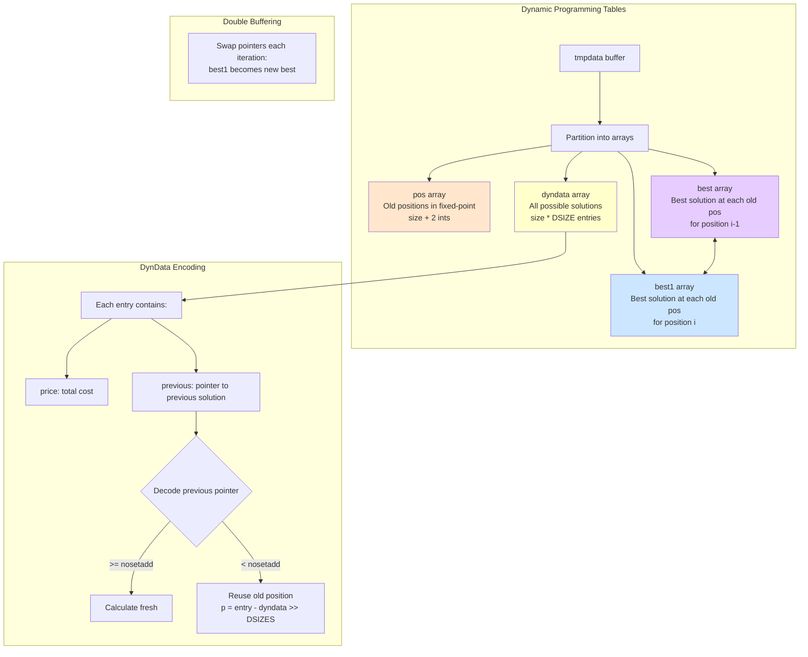
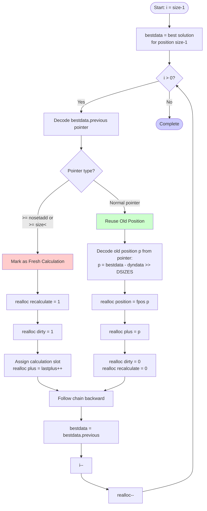
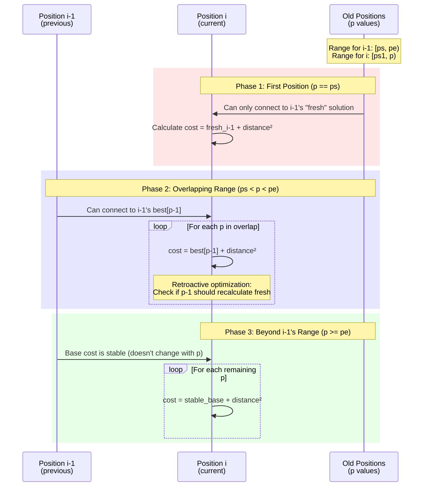
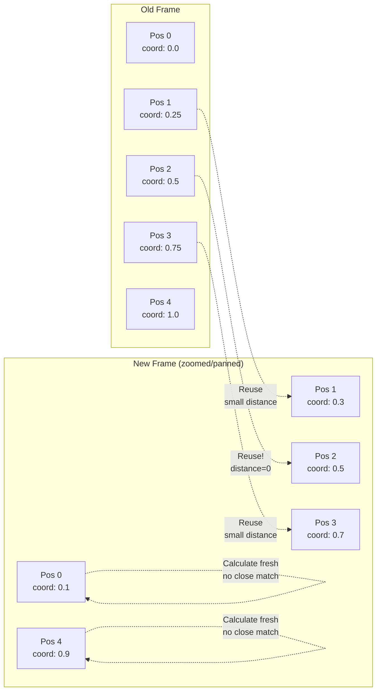

# XaoS Dynamic Programming Algorithm Visualization

This document visualizes the dynamic programming technique used in `src/engine/zoom.cpp` for optimal fractal zooming.

## 1. High-Level Algorithm Flow

## 2. Cost Model & Decision Process

## 3. Forward Pass: State Transitions

## 4. Data Structures & Storage Layout

## 5. Backward Pass: Backtracking

## 6. Range Processing: Three Phases

## 7. Example Walkthrough

Consider a simple example with 5 positions:

## Key Insights

1. **Dynamic Programming Table**: The algorithm builds a table of size `n × DSIZE` where `n` is the number of rows/columns. Each entry stores the minimum cost to reach that state.

2. **Cost Function**:
   - **Reuse cost**: `(old_position - new_position)²` (in fixed-point)
   - **Fresh calculation cost**: `NEWPRICE = (4 × step)²`
   - The algorithm picks whichever is cheaper

3. **No Doubling Constraint**: Each old position can be reused at most once, preventing visual artifacts from duplicating rows/columns.

4. **Retroactive Optimization**: When the algorithm discovers a better path (lines 869-875 in zoom.cpp), it goes back and updates previous decisions. This is a clever optimization that improves solution quality.

5. **Fixed-Point Arithmetic**: All positions are converted to fixed-point integers (`FPMUL = 64`) for faster computation without floating-point overhead.

6. **Symmetry Optimization**: After finding the optimal solution, `preparesymmetries()` exploits fractal symmetries to avoid even more calculations.

## Performance Impact

This algorithm is why XaoS can zoom smoothly in real-time:
- Instead of recalculating all pixels, it reuses ~70-90% of old rows/columns
- The DP overhead is only ~4% of total calculation time (per comments)
- Solid guessing further reduces pixel calculations by detecting uniform regions

## Related Files

- [src/engine/zoom.cpp:658-1120](src/engine/zoom.cpp#L658-L1120) - The `mkrealloc_table()` function
- [src/engine/calculate.h](src/engine/calculate.h) - The expensive `calculate()` function this algorithm tries to avoid
- [docs/algorithms.md](docs/algorithms.md) - Documentation on the approximation algorithm
